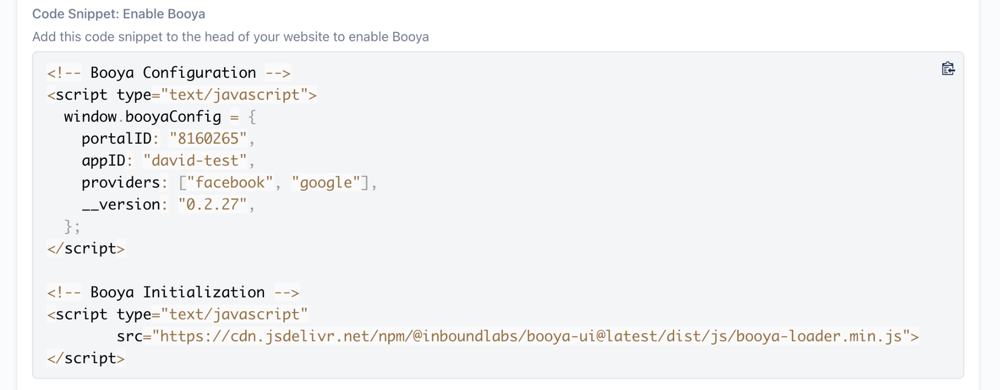
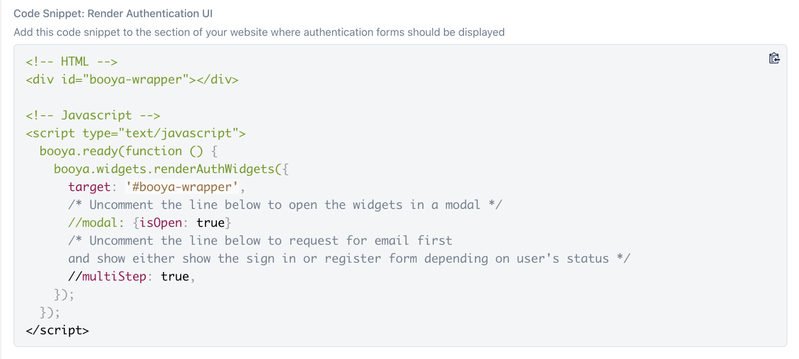
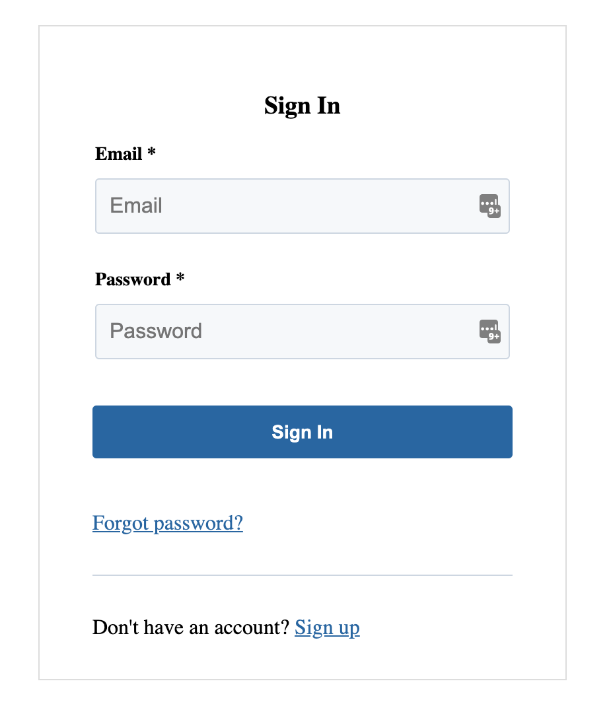
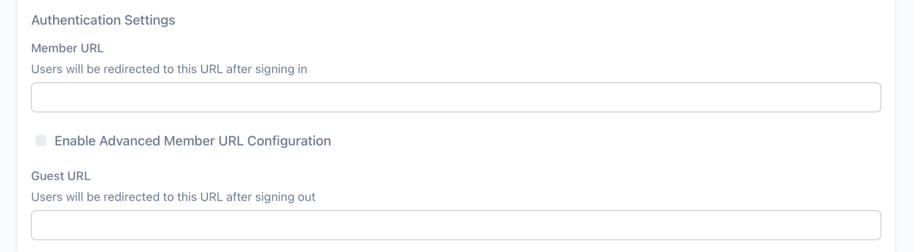
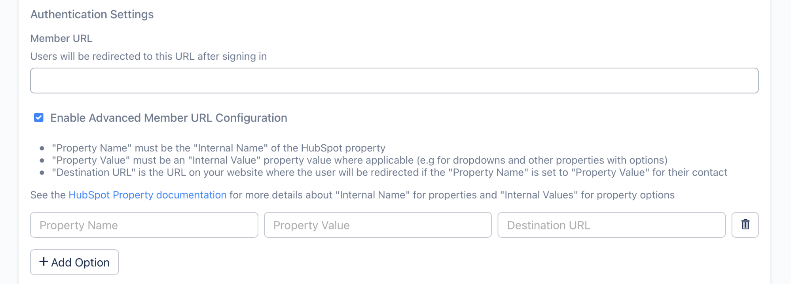
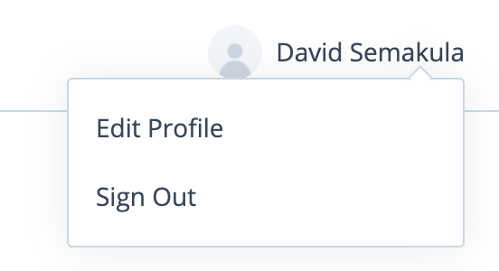
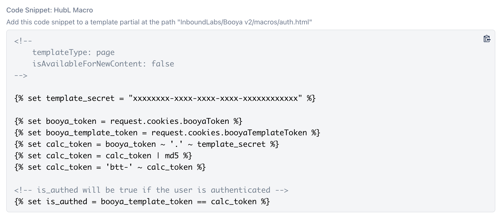

## 1. Add Booya to your website

**NOTE**: To see Code Snippets at [go.booya.io](https://go.booya.io), you need to enable the "Show Code Snippets" toggle.

### 1.1 Enable Booya

**IMPORTANT:** This snippet is already included in BRiX templates so it doesn't need to be added for BriX users.

Copy the code snippet from "Code Snippet: Enable Booya" from the Integration page (enable the "Show Code Snippets" toggle to see this section) and add it to your website or portal.



**NOTE:** Preferably, this should be added in the head area of all your pages. Follow this [guide for HubSpot websites](https://knowledge.hubspot.com/cos-general/how-can-i-add-code-snippets-to-the-head-and-footer-html-of-my-pages) for additional help.

### 1.2 Add Authentication UI to a section, page or module

Copy the code snippet from "Code Snippet: Render Authentication UI" from the Integration page (enable the "Show Code Snippets" toggle to see this section) and add it to the relevant section, page or module of your website.



This code snippet will add an authentication widget with sign in, sign up and recover password forms with links that allow the user to switch between different forms.



NOTE: For version 0.2.7 and higher of the Booya UI Library, changes made to the Registration form in HubSpot are synchronized with this authentication widget.

### 1.3 Redirect user to a different page after sign in or logout

#### 1.3.1 Configure redirects in [go.booya.io](https://go.booya.io)
Set the "Member URL" and "Guest URL" in the Admin Dashboard under "Authentication Settings". Users will be redirected to the "Member URL" after sign in and to the "Guest URL" after logout.



For more advanced redirect behaviour on sign in based on contact properties on sign in, check the "Enable Advanced Member URL Configuration" and add an option for each redirect based on a contact property value.



**NOTE:** With "Member URL", "Guest URL" and optionally "Advanced Member URL Configuration" configuration setup
- Users will be redirected to the "Member URL" or a matching url in "Advanced Member URL Configuration" after signing in
- Users will be redirected to "Guest URL" on logging out
- Logged in users landing on the "Guest URL" will be redirected to the "Member URL" or a matching url in "Advanced Member URL Configuration"
- Logged out users landing on "Member URL" or any url in the "Advanced Member URL Configuration" will be redirected to the "Guest URL"

**NOTE:** This requires version 0.2.21 or higher of the Booya UI Library.

To override advanced redirect behaviour from JavaScript, listen for the `booya.events.MEMBER_URL_REDIRECT` event

```JavaScript
booya.ready(function () {
  // Adding an event listener for prevent the default redirect behaviour
  booya.on(booya.events.MEMBER_URL_REDIRECT, function (e) {
    // Retrieve user and nextUrl
    var user = e.user,
      nextUrl = e.nextUrl;
    
    if(user.hs_property_name === 'hs_property_value') {
      // Perform whatever action is desired for this type of user
    } else {
      // Perform the default redirect
      location.href = nextUrl;
    }
  });
});
```

#### 1.3.2 Implement advanced redirects based on user's contact properties and authentication status
```JavaScript
booya.ready(function () {
  // Adding an event listener for prevent the default redirect behaviour
  booya.on(booya.events.IDENTIFY_SUCCESS, function (e) {
    // Retrieve user
    var user = e.user;
    
    // Perform custom redirect based on current url and user's contact property values
  });
  
  // Listen for logout event
  booya.on(booya.events.LOGOUT_SUCCESS, function (e) {
    // Check if user isn't at the login page and redirect them if necessary
  });

});
```


### 1.4 Add a user widget after authentication and remove it on logout

**IMPORTANT:** For BRiX users, this functionality is included in the "Authentication" module, so the snippets below should only be for more advanced customization of the default authentication behaviour.

The user widget shows the user's avatar and name and includes options to "Edit Profile" and "Sign Out" on hover/focus.



**HTML:**
```HTML
<!-- Add a wrapper for the user widget to the page HTML -->
<div id="booya-user-wrapper"></div>

```

**JavaScript:**
```JavaScript
booya.ready(function () {
  // Listen for identification event
  booya.on(booya.events.IDENTIFY_SUCCESS, function (e) {
    // Add the user widget
    booya.widgets.renderUserWidget("#booya-user-wrapper");
  });
});
```

**NOTE:** The widget handles the logout event automatically by either redirecting the user 
to the "Guest URL" (if one is set at [go.booya.io](https://go.booya.io)) or reloading the current page.
However, you can override the `booya.events.LOGOUT_SUCCESS` event to implement custom logout behaviour.
```JavaScript
booya.ready(function () {
  // Listen for logout event
  booya.on(booya.events.LOGOUT_SUCCESS, function (e) {
    // Remove user widget
    $("#booya-user-wrapper").html("");
    // Do other things e.g redirects
  });
});
```

### 1.5 Access authenticated user's contact properties

```JavaScript
booya.ready(function () {
  // Listen for identification event
  booya.on(booya.events.IDENTIFY_SUCCESS, function (e) {
    // Retrieve user object
    var user = e.user;
    // do something with user contact properties e.g user.hs_property_name
  });
});
```

### 1.6 Edit Registration/ Sign Up and Profile Forms

Changes made to the HubSpot forms set as **"HubSpot Registration Form ID"** and **"HubSpot Profile Form ID"** in [go.booya.io](https://go.booya.io) will be reflected in the Sign Up and Edit Profile forms on your website. 

These HubSpot forms are automatically created by Booya and named **"Booya: Registration Form"** and **"Booya: Profile Form"** by default, however, they can be changed to other HubSpot forms in [go.booya.io](https://go.booya.io).

**IMPORTANT:**
- Both HubSpot forms should include an email field otherwise submissions from your website will fail because submissions need to be associated with a contact.
- The registration form in HubSpot shouldn't include a password field, this field is automatically added by Booya and passwords are **NOT** stored in HubSpot. Booya stores passwords as [Bcrypt](https://en.wikipedia.org/wiki/Bcrypt) hashes in a MongoDB database for email authentication.
- While the profile form in HubSpot must include an email, this field will not be shown on your website because it's autofilled by Booya when submitting to HubSpot.
- This requires version 0.2.7 or higher of the Booya UI Library.

### 1.7 Protecting content in HubL

- Create a template partial at the path "InboundLabs/Booya v2/macros/auth.html"

- Copy the HubL code snippet from "Code Snippet: HubL Macro" from the Integration page (enable the "Show Code Snippets" toggle to see this section) into it.



- You can then import "InboundLabs/Booya v2/macros/auth.html" as a macro in your modules and templates and conditionally show content only if "is_authed" is true as shown below

``` HTML



<!-- Secure content goes here -->


```

### 1.8 Multi-language support

Booya widgets include translations for English (en), French (fr) and Spanish (es).

Booya automatically attempts to detect the language of the page using the [lang](https://developer.mozilla.org/en-US/docs/Web/HTML/Global_attributes/lang) attribute of the html tag.

The recommended approach for setting the language for your web pages is to properly set the lang attribute on the html tag.

However, you can also manually override the language (e.g to Spanish (es)) using the code snippet below 
```
booya.setConfig({
  language: 'es'
});
```

**NOTE**: Booya defaults to English when either no language or an unsupported language is detected.

**NOTE**: html lang attributes that include dialects and regions (e.g 'en-US', 'es-ES', 'fr-FR') are also supported.

## 2. Booya UI Elements library

### 2.1 Generating HTML for Booya UI elements (e.g forms, modals and widgets)

Below is a list of all available methods for generating HTML for common Booya UI elements.

**NOTE:** All methods can be accessed via `booya.widgets.*` e.g `booya.widgets.renderAuthWidgets()`

**NOTE:** Arguments prefixed with * are required

#### `renderAuthWidgets(options)`

Renders a widget with Sign In (with OAuth buttons), Sign Up and Recover forms with links that switch between the forms. Settings for the forms are dynamically read from Booya Admin.

- `options`: (optional) object, supports the following attributes
  
  - `header`: (optional) string, HTML that will be added at the top of the widget
  
  - `footer`: (optional) string, HTML that will be added at the bottom of the widget

  - `signIn`: (optional) boolean, enabled/disable the sign in form, `true` by default  
  
  - `signUp`: (optional) boolean, enabled/disable the sign up form, `true` by default
  
  - `recover`: (optional) boolean, enabled/disable the account recovery form, `true` by default
  
  - `multiStep`: (optional) boolean, enabled/disable the multi step authentication flow where the user enters their email first and either the sign in or sign up form is shown depending on the user's registration status, `false` by default
  
  - `target`: (optional) string, selector for html element in which the widget should be inserted
  
  - `className`: (optional) string, custom class to add to the widget container element
  
  - `modal`: (optional) object, supports the following attributes
    
    - `isOpen`: (optional) boolean, whether or not the modal should be automatically opened, `false` by default
    
    - `className`: (optional) string, custom class to add to the modal container element


#### `renderUserWidget(target, options)`

Renders a user widget that shows the user's avatar and name and includes options to "Edit Profile" and "Sign Out" on hover/focus.

- `target`: (optional) string, selector for html element in which the user widget should be inserted

- `options`: (optional) object, supports the following attributes

  - `profile`: (optional) function, function to call on clicking "Edit Profile"
  
  - `logout`: (optional) function, function to call on clicking "Sign Out"


#### `renderModal(*title, *content, options)`

Renders a modal

- `title`: (required) string, title of the modal

- `content`: (required) string, HTML content of the modal

- `options`: (optional) object, supports the following attributes

  - `isOpen`: (optional) boolean, whether or not the modal should be automatically opened, `false` by default
  
  - `canClose`: (optional) boolean, whether or not the modal can be closed, `true` by default
  
  - `className`: (optional) string, custom class to add to the modal container element


#### `renderSignInForm(title, fields, action, options)`

Renders a sign in form with email and password fields by default

- `title`: (optional) string, HTML that will be used as the title of the form

- `fields`: (optional) string, HTML that will be used to render the fields in the form

- `action`: (optional) string, Submit button text

- `options`: (optional) object, supports the following attributes

  - `target`: (optional) string, selector for html element in which the form should be inserted
  
  - `success`: (optional) string, Success message
  
  - `error`: (optional) string, Error message


#### `renderSignUpForm(title, fields, action, options)`

Renders a sign up/register form with email, password, first_name, last_name and phone fields by default

- `title`: (optional) string, HTML that will be used as the title of the form

- `fields`: (optional) string, HTML that will be used to render the fields in the form

- `action`: (optional) string, Submit button text

- `options`: (optional) object, supports the following attributes

  - `target`: (optional) string, selector for html element in which the form should be inserted
  
  - `success`: (optional) string, Success message
  
  - `error`: (optional) string, Error message


#### `renderRecoverForm(title, fields, action, options)`

Renders an account recovery form with an email field by default

- `title`: (optional) string, HTML that will be used as the title of the form

- `fields`: (optional) string, HTML that will be used to render the fields in the form

- `action`: (optional) string, Submit button text

- `options`: (optional) object, supports the following attributes

  - `target`: (optional) string, selector for html element in which the form should be inserted
  
  - `success`: (optional) string, Success message
  
  - `error`: (optional) string, Error message


#### `renderResetForm(title, fields, action, options)`

Renders a password reset/change form with  password and confirm password fields by default

- `title`: (optional) string, HTML that will be used as the title of the form

- `fields`: (optional) string, HTML that will be used to render the fields in the form

- `action`: (optional) string, Submit button text

- `options`: (optional) object, supports the following attributes

  - `target`: (optional) string, selector for html element in which the form should be inserted
  
  - `success`: (optional) string, Success message
  
  - `error`: (optional) string, Error message


#### `renderProfileForm(title, fields, action, options)`

Renders a sign up/register form with first_name, last_name and phone fields by default

- `title`: (optional) string, HTML that will be used as the title of the form

- `fields`: (optional) string, HTML that will be used to render the fields in the form

- `action`: (optional) string, Submit button text

- `options`: (optional) object, supports the following attributes

  - `target`: (optional) string, selector for html element in which the form should be inserted
  
  - `success`: (optional) string, Success message
  
  - `error`: (optional) string, Error message


### 2.2 Adding UI elements to the page

#### 2.2.1 HTML

``` HTML
<!-- Add a wrapper for the UI element to the page HTML -->
<div id="booya-wrapper"></div>
```

#### 2.2.2 JavaScript

**NOTE:** All Booya code should be wrapped inside a ready callback to allow deferred loading of the UI library e.g
``` JavaScript
booya.ready(function () {
  // Code goes here
});
```

##### Authentication Widget: 
Add an auth widget with all options for user registration including Sign In, Sign Up, Recovery and OAuth with links that switch between options
``` JavaScript
booya.ready(function () {
  booya.widgets.renderAuthWidgets({
    target: "#booya-wrapper"
  }); 
});
```

##### Authentication Widget - Modal: 
``` JavaScript
booya.ready(function () {
  booya.widgets.renderAuthWidgets({
    target: "#booya-wrapper",
    modal: {isOpen: true}, // isOpen will automatically open the modal
  });
});
```

##### Authentication Widget - MultiStep: 
Request email first and show either Sign In or Sign Up form depending on user's status
``` JavaScript
booya.ready(function () {
  booya.widgets.renderAuthWidgets({
    target: "#booya-wrapper",
    multiStep: true,
  });
});
```
**NOTE:** This integration requires version 0.2.4 or higher of the Booya UI Library

##### Authentication Widget - Magic Link sign in enabled: 
``` JavaScript
booya.ready(function () {
  booya.widgets.renderAuthWidgets({
    target: "#booya-wrapper",
    magicLink: true,
  });
});
```
**NOTE:** This integration requires version 0.2.6 or higher of the Booya UI Library

##### Authentication Widget - No Sign In: 
``` JavaScript
booya.ready(function () {
  booya.widgets.renderAuthWidgets({
    target: "#booya-wrapper",
    signIn: false,
  });
});
```
**NOTE:** This integration requires version 0.2.6 or higher of the Booya UI Library

##### Authentication Widget - No Sign Up: 
Request email first and show either Sign In or Sign Up form depending on user's status
``` JavaScript
booya.ready(function () {
  booya.widgets.renderAuthWidgets({
    target: "#booya-wrapper",
    signUp: false,
  });
});
```
**NOTE:** This integration requires version 0.2.6 or higher of the Booya UI Library

##### Authentication Widget - No Account Recovery: 
``` JavaScript
booya.ready(function () {
  booya.widgets.renderAuthWidgets({
    target: "#booya-wrapper",
    recover: true,
  });
});
```
**NOTE:** This integration requires version 0.2.6 or higher of the Booya UI Library

##### Sign In Form: 
Add a sign in form to the wrapper
``` JavaScript
booya.ready(function () {
  $("#booya-wrapper").html(
    booya.widgets.renderSignInForm()
  );
  booya.initUI(); // Not necessary if a target is added via "options"
});
```

##### Sign In Form - Modal:
Add a sign in form wrapped in a modal to the wrapper
``` JavaScript
booya.ready(function () {
  booya.widgets.renderModal(
    "Sign In", 
    booya.widgets.renderSignInForm(),
    {
      target: "#booya-wrapper",
      modal: {isOpen: true},
    }
  );
});
```

##### Sign Up form: 
Add a sign up form to the wrapper
``` JavaScript
booya.ready(function () {
  $("#booya-wrapper").html(
    booya.widgets.renderSignUpForm()
  );
  booya.initUI(); // Not necessary if a target is added via "options"
});
```

##### 2.2.13 Sign Up Form - Customized:
Add a customized sign up form to the wrapper
``` JavaScript
booya.ready(function () {
  booya.widgets.renderSignUpForm(
    "<h2>Register</h2>", // Custom Title
    "<input name="email" type="email" required/>" + // Customized Fields
    "<input name="password" type="password" required/>" +
    "<input name="first_name" type="text" required/>" +
    "<input name="last_name" type="text" required/>",
    "Register", // Custom Action
    {
      "target": "#booya-wrapper",      
      "error": "Something's wrong" // Custom error message
      "success": "Awesome", // Custom success message
      "warning": "Bad data", // Custom validation message
    } 
  );
});
```

## 3. Booya Events

### 3.1 List of available events

**NOTE:** All event constants can be accessed via `booya.events.*` e.g `booya.events.IDENTIFY_SUCCESS`

#### `booya.events.READY`
Fired when booya is fully initialized (portalID and appID are set up)

#### `booya.events.IDENTIFY_SUCCESS`
Fired when a user is identified (e.g either when they login or a new page is loaded for an existing session)

A `user` object is included in the event data.

#### `booya.events.IDENTIFY_FAILED`
Failure version of `booya.events.IDENTIFY_SUCCESS`

A `user` object is included in the event data.

#### `booya.events.VERIFY_EMAIL_SUCCESS`
Fired as the success event for two legged sign in and sign up flows where an email is first entered before either a registration form is shown or a password form is shown. 

A password form should be displayed when this event is fired

A `email` is included in the event data.

#### `booya.events.VERIFY_EMAIL_FAILED`
Failure version of `booya.events.VERIFY_EMAIL_SUCCESS`

A registration form should be displayed when this event is fired

A `email` is included in the event data.

#### `booya.events.LOGOUT_SUCCESS`
Fired when a user logs out

#### `booya.events.LOGOUT_FAILED`
Failure version of `booya.events.LOGOUT_SUCCESS`

#### `booya.events.MAGIC_LINK_REQUEST_SUCCESS`
Fired when a magic link is requested successfully.

#### `booya.events.MAGIC_LINK_REQUEST_FAILED`
Failure version of `booya.events.MAGIC_LINK_REQUEST_SUCCESS`

#### `booya.events.MAGIC_LINK_VERIFY_SUCCESS`
Fired when a user is logged in with a magic link successfully

#### `booya.events.MAGIC_LINK_VERIFY_FAILED`
Failure version of `booya.events.MAGIC_LINK_VERIFY_SUCCESS`

#### `booya.events.MEMBER_URL_REDIRECT`
Fired before an authenticated user is redirected because of a matching "Advanced Member URL Configuration"

A `user` object and the `nextUrl` is included in the event data.

#### `booya.events.GUEST_URL_REDIRECT`
Fired before an unauthenticated user is redirected because of a matching "Advanced Member URL Configuration"

The `nextUrl` is included in the event data.


### 3.2 How to listen for events

``` JavaScript
booya.on(booya.events.IDENTIFY_SUCCESS, function (e) {
  // Log user data
  console.log("user identified", e.user);
});
```

**NOTE:** Event listeners should be wrapped inside `booya.ready` callbacks
 
 